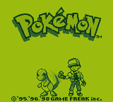

# Pokemon Static Recompilation

> *What if we just... turned the whole ROM into C and ran it natively?*

A static recompiler that translates Pokemon Game Boy ROMs (SM83 CPU) into native C code, then runs them with [gb-recompiled](https://github.com/sp00nznet/gb-recompiled)'s runtime — complete with ImGui debug GUI, asset viewer, interpreter fallback, and CGB color support. No interpreter loop. No JIT. Just 64 banks of generated C functions that think they're running on a Game Boy.

## Supported Games

| Game | ROM Type | Color | Status |
|------|----------|-------|--------|
| **Pokemon Red** | DMG / MBC3 | Monochrome | Intro through overworld |
| **Pokemon Blue** | DMG / MBC3 | Monochrome | Should work (same engine) |
| **Pokemon Yellow** | GBC / MBC5 | Full CGB Color | Boots and renders with color palettes |

## The Idea

The Game Boy CPU (Sharp SM83) has a finite ROM. Every instruction has a fixed address. So instead of emulating one opcode at a time, we analyze the entire ROM ahead of time, discover every function and basic block, and generate equivalent C code. At runtime, the generated code calls through gb-recompiled's battle-tested runtime that provides the memory bus, PPU, APU, timers, and everything else the game expects.

Unknown code paths automatically fall back to a real SM83 interpreter — no more silent dispatch failures.

### Recompiler Pipeline

```
ROM binary --> Decoder (SM83 instructions)
           --> Analyzer (functions, basic blocks, control flow graph)
           --> Codegen (C source per bank + dispatch table)
           --> gb-recompiled runtime (SDL2 + ImGui + interpreter fallback)
```

Each ROM function becomes a C function (`func_b01_42B7`). Branches become `goto`. Calls become C calls. Hardware ops go through gbrt. Interrupts are checked cooperatively at basic block boundaries and HALT instructions.

## How Far Does It Get?

**Pretty far.** The full intro sequence plays with graphics, the title screen works, and you can get into the overworld:

| Copyright | Game Freak Intro | Title Sequence |
|:---:|:---:|:---:|
|  |  |  |

| Nidorino vs Gengar | Battle Intro | Oak's Lab |
|:---:|:---:|:---:|
|  |  |  |

**Current progression (Red):** Copyright -> Game Freak -> Nidorino battle -> cycling Pokemon -> title screen -> main menu -> NEW GAME -> Oak's intro -> name entry -> overworld (Pallet Town) -> Oak's Route 1 script (in progress)

**Current progression (Yellow):** Boots into CGB mode, runs init sequence, renders with color palettes. Title screen in progress.

## Building

### Prerequisites
- CMake 3.16+
- MSVC 2022 (Windows) or GCC/Clang
- SDL2 (via vcpkg recommended)
- Python 3.11+ with PyBoy (`pip install pyboy`) for ground truth traces
- A Pokemon ROM file -- you supply your own

### Steps

```bash
# Clone with submodule
git clone --recursive https://github.com/sp00nznet/pokemon.git
cd pokemon

# If imgui submodule is empty:
git clone https://github.com/ocornut/imgui.git gbrecomp/runtime/third_party/imgui
git -C gbrecomp/runtime/third_party/imgui checkout 277ae93c41

# Configure
cmake -B build -DCMAKE_TOOLCHAIN_FILE=C:/vcpkg/scripts/buildsystems/vcpkg.cmake

# Build the recompiler
cmake --build build --target recompiler --config Release

# Recompile a ROM (generates ~64 C files + dispatch table)
./build/tools/recompiler/Release/recompiler.exe "roms/Pokemon Red Version.gb" -o src/generated
# or for Yellow:
./build/tools/recompiler/Release/recompiler.exe "roms/Pokemon Yellow Version - Special Pikachu Edition.gbc" -o src/generated

# Reconfigure (picks up generated files)
cmake -B build -DCMAKE_TOOLCHAIN_FILE=C:/vcpkg/scripts/buildsystems/vcpkg.cmake

# Build the game
cmake --build build --target pokemon_red --config Release   # or pokemon_yellow

# Play
./build/Release/pokemon_red.exe
```

### Trace-Guided Recompilation

The recompiler supports `--use-trace` to seed function discovery with PyBoy execution traces:

```bash
# Capture ground truth from PyBoy (dense trace with call targets)
python tools/pyboy_dense_trace.py "roms/Pokemon Yellow Version - Special Pikachu Edition.gbc" \
    -o pokemon_yellow_dense.trace --frames 9000

# Filter to call/jump targets only
python -c "..." > pokemon_yellow_filtered.trace

# Recompile with trace seeds
./build/tools/recompiler/Release/recompiler.exe "roms/Pokemon Yellow Version - Special Pikachu Edition.gbc" \
    -o src/generated --use-trace pokemon_yellow_filtered.trace
```

## Debugging Infrastructure

### Hardware Trace Comparison

Compare recompiled output against PyBoy frame-by-frame:

```bash
# Capture PyBoy ground truth
python tools/pyboy_hwtrace.py "roms/Pokemon Red Version.gb" -o pyboy_trace.log --frames 1000

# Run recompiled game with hwtrace
./build/Release/pokemon_red.exe --hwtrace recomp_trace.log --stop-at 1000

# Compare (71-frame offset for boot ROM)
python tools/compare_traces.py pyboy_trace.log recomp_trace.log --offset 71
```

### CLI Flags

| Flag | Description |
|------|-------------|
| `--stop-at N` | Auto-exit after N frames |
| `--auto-input "F:btn:dur"` | Automated button presses |
| `--hwtrace file` | Per-frame hardware state CRCs |
| `--trace-entries file` | Log dispatch entry points |
| `--wram-dump N` | Binary WRAM dump at frame N |
| `--dump-frames "N,M"` | Screenshot specific frames |
| `--debug-dispatch` | Log every dispatch call |
| `--watch 0xD730` | Memory watchpoint |

## Architecture

### Runtime: gb-recompiled

The game links against [gb-recompiled](https://github.com/sp00nznet/gb-recompiled)'s `gbrt` library which provides:

- **Full GB/CGB hardware emulation** (PPU, APU, timer, MBC1/3/5, DMA, serial)
- **SM83 interpreter** for fallback execution of undiscovered code
- **SDL2 + ImGui frontend** with asset viewer (tiles, sprites, tilemaps, palettes)
- **Save states and battery RAM persistence**
- **Hardware trace output** in SameBoy-compatible format

### Pokemon-Specific Bridge

| File | Purpose |
|------|---------|
| `src/pokemon_rt.h` | Sync, HALT, interrupt helpers for generated code |
| `src/pokemon_debug.c/h` | Dispatch trace ring buffer, memory watchpoints |
| `src/generated/stubs.c` | Game-specific stubs (Bankswitch, Predef, CallFunctionInTable) |

### Recompiler

```
tools/recompiler/
  decoder.c         SM83 instruction decoder (all opcodes + CB prefix)
  analyzer.c        Function/block discovery, trace loading, dispatch seeds
  codegen.c         C code generation targeting GBContext API
  symbols.c         Symbol table (entry points, predef tables, farcall patterns)
  main.c            CLI with --use-trace support
```

## Key Technical Details

- **Register pairs use C unions:** `ctx->hl` for 16-bit, `ctx->h`/`ctx->l` for 8-bit
- **Flags unpacked for performance:** `ctx->f_z`, `ctx->f_n`, `ctx->f_h`, `ctx->f_c`
- **Inline ALU:** Addition/subtraction/logic emitted inline (no function call overhead)
- **Cooperative interrupts:** Checked at basic block boundaries via `pokemon_sync(ctx)`
- **Interpreter fallback:** Unknown dispatch targets use `gb_interpret(ctx, addr)` instead of crashing
- **Game-aware stubs:** Bankswitch/Predef/CallFunctionInTable at Red-specific (0x35D6/0x3E6D/0x3D97) and Yellow-specific (0x3E84/0x3EB4/0x3D93) addresses
- **Auto-detected entry point:** ROM header's JP target (Red: 0x0150, Yellow: 0x01AB)

## ROM Files

Place ROM files in `roms/` (gitignored):
- `Pokemon Red Version.gb`
- `Pokemon Blue Version.gb`
- `Pokemon Yellow Version - Special Pikachu Edition.gbc`

## License

This project is for educational and research purposes. No ROM data is included -- you must provide your own legally obtained ROM files.
