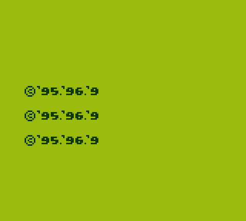
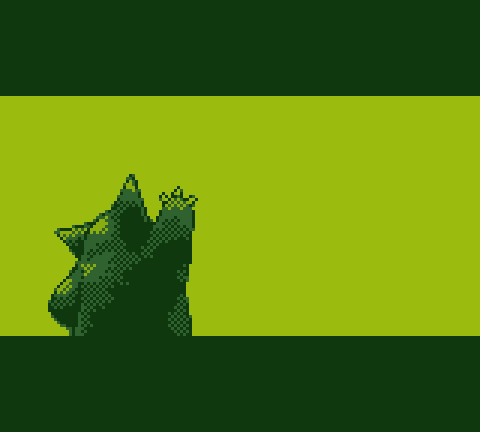
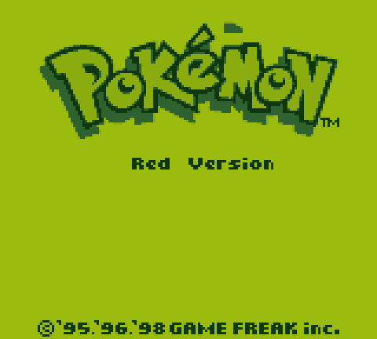
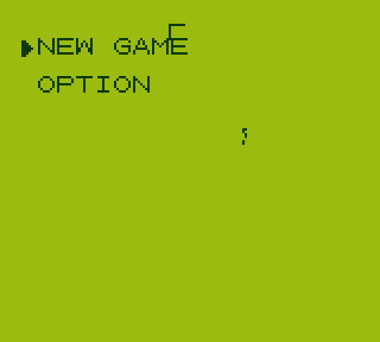

# Pokemon Red - Static Recompilation

A static recompiler that translates the Pokemon Red Game Boy ROM (SM83 CPU) into C code, then runs it natively with a hardware abstraction layer and SDL2 frontend.

## How It Works

1. **Recompiler** (`tools/recompiler/`) - Analyzes the ROM, discovers functions and basic blocks, and generates equivalent C code for each bank
2. **HAL** (`src/hal/`) - Game Boy hardware abstraction: CPU state, memory bus (MBC3), PPU (pixel processing), timer, joypad, DMA, serial, interrupts
3. **Platform** (`src/platform/`) - SDL2 rendering, audio, and input
4. **Generated Code** (`src/generated/`) - Auto-generated C functions from ROM analysis, plus hand-written stubs for special cases

### Recompiler Pipeline

```
ROM binary → Decoder (SM83 → instructions) → Analyzer (functions, basic blocks, control flow)
           → Codegen (C source per bank) → Dispatch table (function routing)
```

Each ROM function becomes a C function. Branches become `goto`, calls become C function calls, and hardware operations go through the HAL. Interrupts are checked cooperatively at basic block boundaries and HALT instructions.

## Building

### Prerequisites
- CMake 3.16+
- MSVC 2022 (Windows) or GCC/Clang
- SDL2 (via vcpkg recommended)
- A Pokemon Red ROM file (`roms/Pokemon Red Version.gb`)

### Steps

```bash
# Configure
cmake -B build -DCMAKE_TOOLCHAIN_FILE=C:/vcpkg/scripts/buildsystems/vcpkg.cmake

# Build the recompiler
cmake --build build --target recompiler --config Release

# Generate C code from ROM
./build/tools/recompiler/Release/recompiler.exe "roms/Pokemon Red Version.gb" -o src/generated

# Reconfigure (picks up new generated files)
cmake -B build -DCMAKE_TOOLCHAIN_FILE=C:/vcpkg/scripts/buildsystems/vcpkg.cmake

# Build the game
cmake --build build --target pokemon_red --config Release

# Run
./build/Release/pokemon_red.exe "roms/Pokemon Red Version.gb"
```

## Screenshots

The game boots and runs through the full intro sequence natively:

| Game Freak | Intro Sequence | Title Screen | Main Menu |
|:---:|:---:|:---:|:---:|
|  |  |  |  |

## Current Status

**Working:**
- Full ROM analysis and C code generation for all 64 banks
- Hardware abstraction (CPU, memory/MBC3, PPU, APU, timer, joypad, DMA, serial, interrupts)
- SDL2 window with pixel rendering and audio output
- Game boots and runs through intro sequence, title screen, and main menu
- Title screen renders with scrolling Pokemon silhouettes
- Sprite decompression working (Nidorino intro scene)
- Multiple LCD scene transitions work correctly
- Audio: all 4 channels (2x pulse, wave, noise) with proper DAC centering and Bresenham sample timing
- Non-local return (POP trick) detection automated in codegen via table-driven NLR system
- STAT interrupt edge detection (STAT blocking) with write glitch emulation
- Timer accuracy: TAC/DIV write glitches, overflow delay, falling-edge detection
- Serial link cable timeout (completes transfers with 0xFF for no device)
- Frame timing using high-resolution performance counters (accurate 59.73 fps)
- Audio thread safety with mutex-protected sample buffer
- SRAM save/load with persistence on exit

**In Progress:**
- Further game progression (exploring menus and gameplay)
- Visual accuracy refinements
- Audio quality tuning (envelope, sweep timing)

## Project Structure

```
tools/recompiler/       SM83-to-C static recompiler
  decoder.c             Instruction decoder
  analyzer.c            Function/block discovery, control flow analysis
  codegen.c             C code generation
  symbols.c             Symbol table management
  main.c                Entry point

src/hal/                Game Boy hardware abstraction layer
  cpu.c/h               CPU state, interrupts, HALT
  memory.c/h            Memory bus, MBC3 banking, I/O registers
  ppu.c/h               Pixel Processing Unit
  timer.c/h             Timer/divider
  interrupts.c/h        Interrupt handling
  joypad.c/h            Input
  dma.c/h               OAM DMA
  apu.c/h               Audio Processing Unit (4 channels)
  serial.c/h            Serial (stub)

src/platform/           SDL2 platform layer
  window.c/h            Window management
  renderer.c/h          Pixel rendering
  audio.c/h             Audio output
  input.c/h             Keyboard input

src/generated/          Auto-generated from ROM
  banks/                Per-bank C files (gitignored)
  dispatch.c/h          Function dispatch table (gitignored)
  stubs.c               Hand-written stubs (committed)
```

## Controls

| Key | Action |
|-----|--------|
| Z | A button |
| X | B button |
| Enter | START |
| Backspace | SELECT |
| Arrow keys | D-Pad |
| Tab (hold) | Fast-forward |
| F11 | Toggle fullscreen |
| M | Toggle mute |

## ROM Files

Place ROM files in `roms/` (gitignored):
- `Pokemon Red Version.gb` - Primary target
- `Pokemon Blue Version.gb` - Untested
- `Pokemon Yellow Version - Special Pikachu Edition.gbc` - Untested

## License

This project is for educational and research purposes. You must provide your own ROM files.
