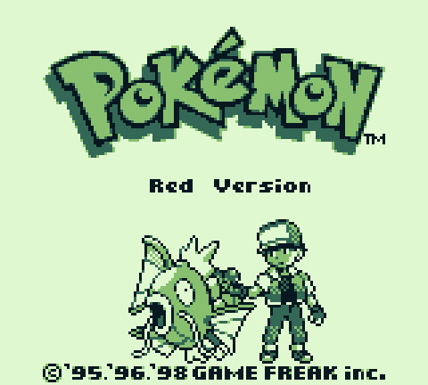
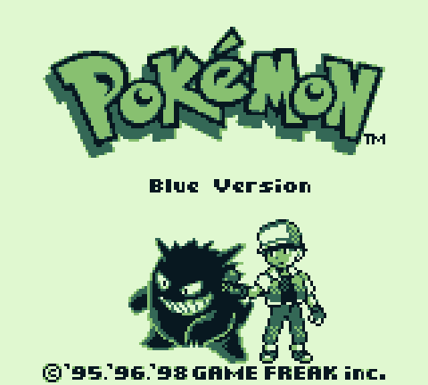
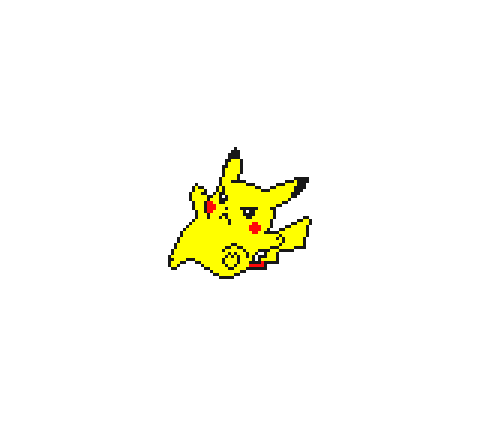
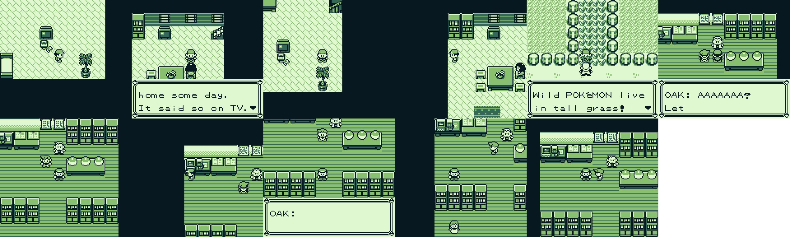

# Pokémon — Statically Recompiled

> *Generation I Pokémon as native executables. No emulator. No ROM interpretation at runtime. Just SM83 assembly translated, ahead of time, into portable C.*

This repository ports **Generation I Pokémon** — Yellow, Red, Blue — to native code via [**gb-recompiled**](https://github.com/sp00nznet/gb-recompiled): a static recompiler that lifts SM83 (Z80-ish) machine code directly into C. Each game builds into its own native `rom.exe`. No emulator in the loop, only a small fallback interpreter for indirect jumps the static analyser couldn't resolve.

Sibling projects on the same toolchain: [`LinksAwakening`](https://github.com/sp00nznet/LinksAwakening), [`pokemon-gold`](https://github.com/sp00nznet/pokemon-gold), [`pokemon-crystal`](https://github.com/sp00nznet/pokemon-crystal), [`oracle-recompiled`](https://github.com/sp00nznet/oracle-recompiled).

---

## Gallery

| Pokémon Red | Pokémon Blue | Pokémon Yellow |
|:--:|:--:|:--:|
|  |  |  |

All three boot as **native executables** rendered from their own translated C — no emulator at runtime. Frames are dumped straight from the recompiled engine's framebuffer.



A reinforcement-learning agent ([PWhiddy's PokemonRedExperiments](https://github.com/PWhiddy/PokemonRedExperiments), unmodified) driving our **recompiled** Red: out of the bedroom, into Pallet Town, the "Wild POKéMON live in tall grass!" event, and into Oak's Lab — every frame computed by the recompiled engine, not an emulator.

---

## Status

| Game | Cart | Color | Status |
|---|---|---|---|
| **Pokémon Yellow** | MBC5, GBC | CGB palettes | ✅ Boots; GAME FREAK + Pikachu intro render with correct palettes |
| **Pokémon Red** | MBC3, DMG | Mono | ✅ Boots to the title screen and into gameplay. Also builds a headless `rom_headless.dll` driven by an RL bot ([`bot/`](bot/README.md)). |
| **Pokémon Blue** | MBC3, DMG | Mono | ✅ Boots to the title screen (same `GB_MODEL_DMG` recipe as Red); also builds a headless `rom_headless.dll`. |

> **Red boot fix (DMG init).** Red stayed white because the runtime hard-coded a CGB power-on state. `gb_context_create` ignored its `GBConfig` and forced `A=0x11` (the CGB signature) with the PPU in CGB mode. Red is a **DMG** cart and branches on `A` at `$0100`, so it needs `A=0x01` and DMG PPU/palette behaviour. The fix threads `GBConfig.model` through `gb_context_reset` (DMG → `A=0x01B0`, `ppu->cgb_mode=false`), **defaulting to CGB when `config==NULL`** so Yellow is untouched. `red/rom_main.c` now passes `GBConfig{ .model = GB_MODEL_DMG }`.

---

## Layout

```
pokemon/
├── gbrecomp/   submodule → sp00nznet/gb-recompiled (the recompiler + runtime)
├── roms/       your legal ROMs (gitignored)
├── tools/      PyBoy diagnostic scripts + input scripts
├── yellow/     Yellow build dir (rom_main.c + CMakeLists committed; rom.c/rom_rom.c regenerated)
├── red/        Red — boots; also builds rom_headless.dll (platform_headless.c + rom_bridge.c)
├── blue/       Blue — boots; same headless build as Red
├── bot/        RL bot integration — PyBoy-compatible ctypes shim + differential tester + PPO training
└── screenshots/ images used in this README
```

Each game directory is self-contained, matching the `pokemon-gold` convention: tracked `rom_main.c` + `CMakeLists.txt`, generated `rom.c` / `rom.h` / `rom_rom.c` (gitignored, regenerated each recompile).

---

## Building

### Prerequisites

- **Windows 11**: Visual Studio 2022 Build Tools (C++ workload), CMake ≥ 3.20, SDL2 via [vcpkg](https://github.com/microsoft/vcpkg) (`vcpkg install sdl2:x64-windows`).
- **Python 3.11+** with `pyboy` (`pip install pyboy`) — for the ground-truth trace capture.
- A legally obtained ROM placed in `roms/`.

### Clone

```bash
git clone --recurse-submodules https://github.com/sp00nznet/pokemon.git
cd pokemon
```

### Build the gb-recompiled recompiler (once)

```bash
cmake -S gbrecomp -B gbrecomp/build -DCMAKE_TOOLCHAIN_FILE=C:/vcpkg/scripts/buildsystems/vcpkg.cmake
cmake --build gbrecomp/build --target gbrecomp --config Release
```

That produces `gbrecomp/build/bin/Release/gbrecomp.exe`.

### Bring up a game (Yellow shown — Red/Blue are identical with their own ROM)

```bash
# 1) point the recompiler at a rom-named copy so output files are rom.{c,h,_rom.c}
cp "roms/Pokemon Yellow Version - Special Pikachu Edition.gbc" yellow/rom.gbc

# 2) capture a PyBoy ground-truth execution trace
python gbrecomp/tools/capture_ground_truth.py yellow/rom.gbc \
    -o yellow/rom.trace -f 18000 --random

# 3) recompile (writes rom.c, rom.h, rom_main.c, rom_rom.c)
gbrecomp/build/bin/Release/gbrecomp.exe yellow/rom.gbc \
    -o yellow --use-trace yellow/rom.trace

# 4) configure + build
cmake -S yellow -B yellow/build \
    -DCMAKE_TOOLCHAIN_FILE=C:/vcpkg/scripts/buildsystems/vcpkg.cmake
cmake --build yellow/build --config Release

# 5) run
./yellow/build/Release/rom.exe
```

Useful flags on `rom.exe` (from gbrecomp's runtime):

| Flag | Effect |
|---|---|
| `--dump-frames "100,400,900"` | dump frames at the listed numbers as `screenshot_NNNNN.ppm` |
| `--limit N` | cap total instructions (handy for headless smoke tests) |
| `--input FILE` | replay a recorded button script |
| `--trace`, `--trace-entries FILE` | dump every translated instruction address that executed |

---

## How it works

```
ROM (.gb/.gbc)               PyBoy ground truth                gbrecomp
       │                            │                              │
       ▼                            ▼                              ▼
[1 MB SM83 machine code]  +  [proven entry-points trace]  →  [~62 MB native C]
                                                                    │
                                                                    ▼
                                                          cmake / MSVC + SDL2
                                                                    │
                                                                    ▼
                                                  rom.exe (statically recompiled)
                                                  ├─ translated game code
                                                  ├─ gbrt runtime (PPU, APU, MBCs, save)
                                                  └─ SDL2 + Dear ImGui debug overlay
```

The `--use-trace` step is the key: it seeds the recompiler with every `(bank, addr)` PyBoy actually executed, solving the `JP (HL)` / PUSH-ret trampoline patterns Pokémon uses for predef / farcall / jump-table dispatch — control flow the static analyser cannot follow on its own.

See [`gbrecomp/GROUND_TRUTH_WORKFLOW.md`](https://github.com/sp00nznet/gb-recompiled/blob/main/GROUND_TRUTH_WORKFLOW.md) for the detailed flow.

---

## Headless build + RL bot

Beyond the SDL `rom.exe`, Red also builds **`rom_headless.dll`** — the same recompiled engine with no SDL/ImGui, exposing a tiny C ABI (`gbrom_create/step/read/write/set_buttons/framebuffer/snapshot/restore`). A Python ctypes wrapper ([`bot/pyboy_shim.py`](bot/pyboy_shim.py)) presents that DLL as a **drop-in subset of the PyBoy 2.x API**, which lets two things run against our recompiled engine:

1. **Differential testing vs PyBoy** — feed identical inputs to stock PyBoy and our engine, diff memory + screen. This proved the recompilation is **cycle-faithful** (the only startup difference is PyBoy's own boot splash; after phase-alignment the engines match to a handful of RNG/uninitialized bytes).
2. **An RL agent plays it** — [PWhiddy's PokemonRedExperiments](https://github.com/PWhiddy/PokemonRedExperiments) `RedGymEnv`, unmodified, with `PyBoy` monkeypatched to our shim. The agent walks out of the bedroom, into Pallet Town, and into Oak's Lab — driven entirely by our engine.

```bash
cmake --build red/build --target rom_headless --config Release   # build the DLL
python bot/diff_harness.py                                        # differential test vs PyBoy
python bot/run_phase_d.py                                         # watch the RL agent play
python bot/train_ppo_ours.py                                      # real PPO training on our engine
```

Full details — architecture, the boot-splash timing investigation, and how PPO training is wired — are in [`bot/README.md`](bot/README.md).

---

## Notes

- ROMs are **never** committed. Provide your own legal copy under `roms/`.
- Each game's `rom.c` (≈ 66 MB for Yellow) and `rom_rom.c` (≈ 6.6 MB) are generated and gitignored; only `rom_main.c` and `CMakeLists.txt` are tracked per game.
- Re-running the recompiler overwrites the generated `CMakeLists.txt` **and** `rom_main.c`, so re-apply local tweaks afterwards. For Red/Blue specifically: the committed `rom_main.c` passes `GBConfig{ .model = GB_MODEL_DMG }` (a DMG cart needs it to boot) but the recompiler regenerates a CGB-default `rom_main.c` — restore the committed copy, or it will sit on a white screen. Yellow is a real CGB cart and needs no change.
- `tools/pyboy_*.py` are project-specific PyBoy diagnostic scripts kept from the Yellow GAME FREAK palette debugging session.

---

## License

MIT. The runtime (`gbrecomp/runtime/`) is MIT via the gb-recompiled submodule. ROMs are © Nintendo / Game Freak / Creatures — bring your own.
